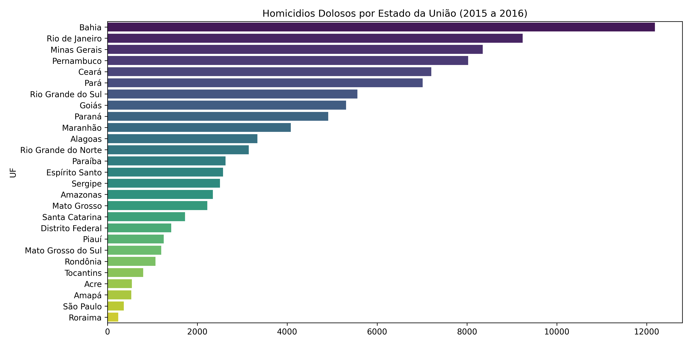
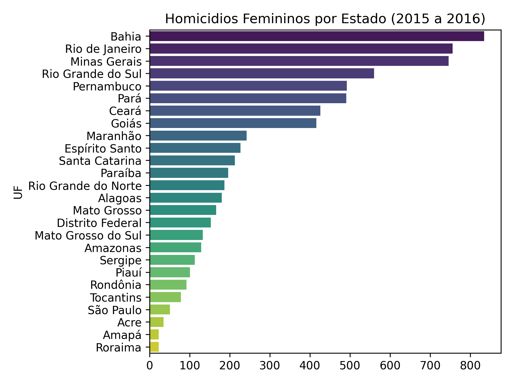
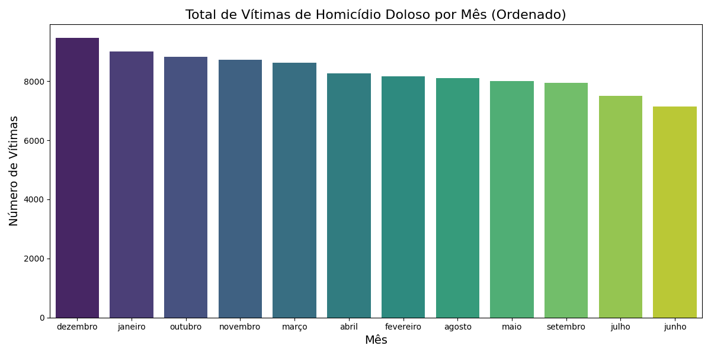
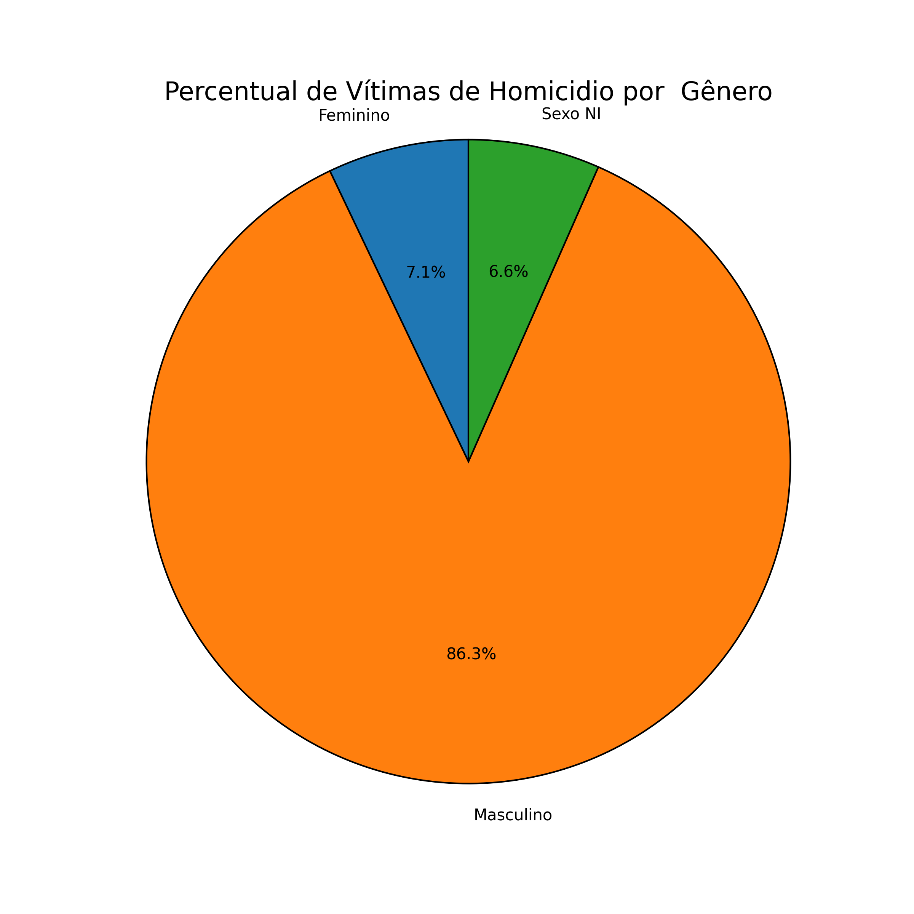
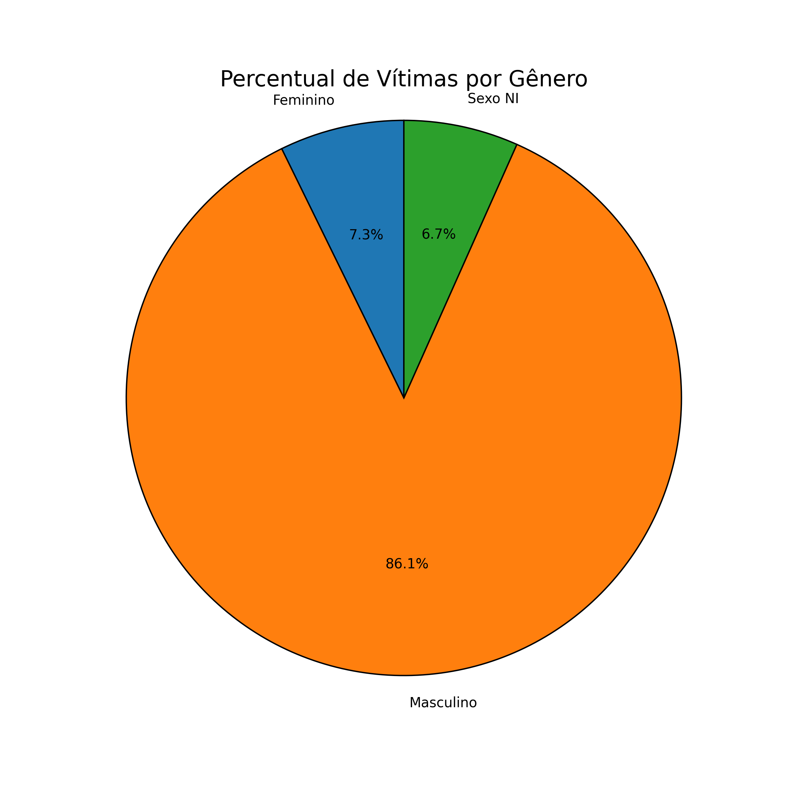

# 🇧🇷 Análise dos Indicadores de Segurança Pública nos Estados Brasileiros (2015-2016)

---

### 📚 Fonte dos Dados

**Ministério da Justiça e Segurança Pública (DNSP)**  
[Indicadores de Segurança Pública (2015-2016)](https://www.gov.br/mj/pt-br/assuntos/sua-seguranca/seguranca-publica/estatistica/download/dnsp-base-de-dados/indicadoressegurancapublicauf_-1.xlsx/view?utm_source=chatgpt.com)

---

## 📊 Visualizações do Projeto

### **Homicídios Dolosos por Estado da União (2015–2016)**  

---

### **Homicídios Femininos por Estado (2015–2016)**  

---

### **Total de Vítimas de Homicídio Doloso por Mês (Ordenado)**  

---

### **Percentual de Vítimas de Homicídio por Gênero**  

---

### **Percentual de Vítimas Registradas por Gênero (Distribuição Geral)**  

---

## 🧾 Conclusão

A análise dos indicadores de segurança pública de 2015 a 2016 revela padrões importantes:

- **Bahia, Rio de Janeiro, Minas Gerais e Pernambuco** concentram os maiores números absolutos de homicídios dolosos, refletindo desafios estruturais enfrentados pelos grandes estados em termos de criminalidade urbana.
- A distribuição mensal mostra que **dezembro, janeiro e outubro** registram os maiores volumes de vítimas — possivelmente influenciados por sazonalidades sociais, eventos e períodos festivos.
- No recorte de gênero, a predominância de vítimas **masculinas (≈ 86%)** é evidente, alinhada a tendências históricas de violência letal no país.
- Os homicídios femininos, embora menores em volume, têm padrões regionais relevantes, com destaque novamente para estados de grande população.

Os dados reforçam a necessidade de políticas públicas regionais específicas, com foco tanto na prevenção quanto no enfrentamento de crimes violentos, considerando diferenças entre estados, sazonalidade e recortes sociais.
